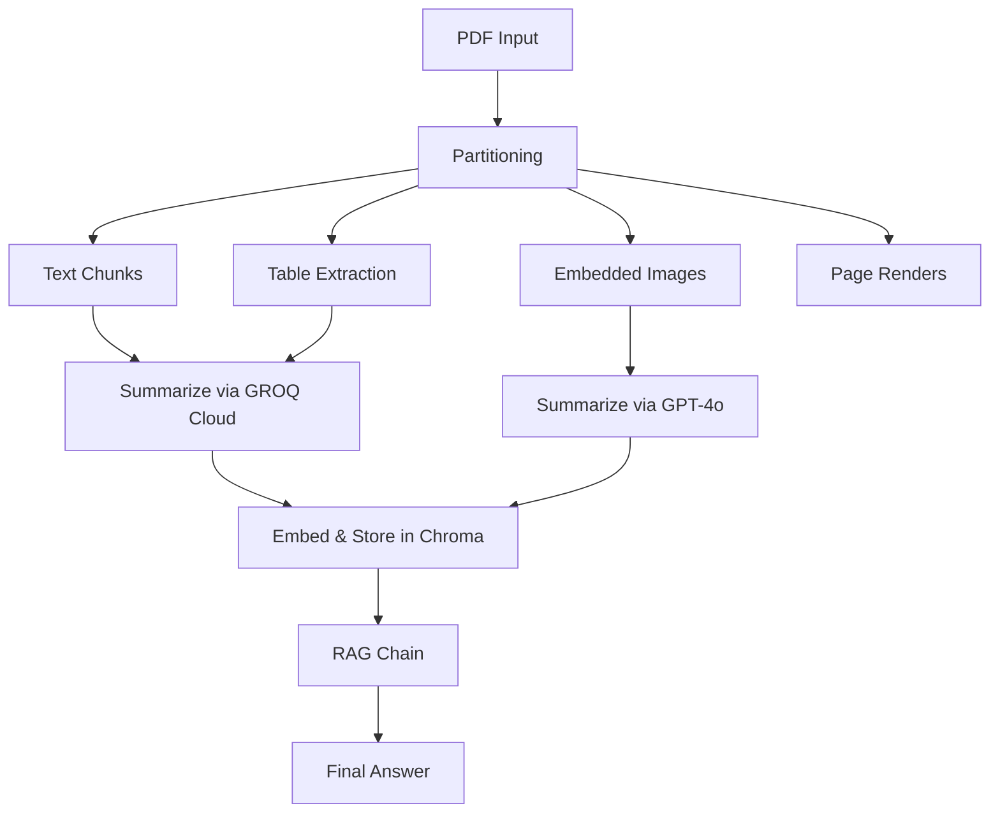

# Document Agentic AI


This repository demonstrates a Retrieval-Augmented Generation (RAG) architecture for processing **PDF documents** with text, tables, and images.

---

## 🚀 Overview

- **PDF Partitioning**: Splits a PDF into text chunks (via a character-based splitter), tables (extracted with Tabula), embedded images, and full-page renders (via PyMuPDF).
- **Summarization**:
  - **Text & Tables**: Summarized using a GROQ Cloud LLM (`llama-3.1-8b-instant`).
  - **Images**: Summarized with GPT-4o for detailed visual context.
- **Vector Store & RAG**:
  - Summaries are embedded (OpenAIEmbeddings) and stored in Chroma + InMemoryStore.
  - A custom RAG chain retrieves relevant summaries (text, table, image) and then generates final answers with GPT-4o-mini.

---

## ⚙️ Architecture



---

## 💡 Key Points & Benefits

1. **High Throughput**: Processes 14 pages of text and tables in **0.01 USD** total using GROQ Cloud LLM.  
2. **Cost-Effective Storage**: Summaries are stored locally via GROQ Cloud for instant retrieval and low ongoing cost.  
3. **Image Understanding**: Leverages GPT-4o (slightly higher cost) only for image summarization at **0.02 USD** per document.  
4. **End-to-End Cost**: Full pipeline on a 15‑page PDF costs **0.03 USD** total—exceptionally low for multimodal document comprehension.  
5. **Modular & Extensible**: Swap in different LLMs or vector stores, adjust chunk sizes, or extend to additional modalities.

---

## 📋 Usage

0. **Add your PDF**: place your PDF file (e.g., `document.pdf`) into the `data/` folder. The pipeline will read this file and automatically create a vector database named `multi_modal_rag`.
1. **Install dependencies**:  
   ```bash
   pip install -r requirements.txt
   ```
2. **Set environment variables**:  
   ```bash
   export GROQ_API_KEY=your_groq_key
   export OPENAI_API_KEY=your_openai_key
   ```
3. **Run the pipeline**:  
   ```bash
   jupyter notebook demo.ipynb
   ```
4. **Query**:  
   Use the provided RAG client or notebook to ask questions over your PDF corpus.

---

## 🔖 License

MIT © Zeel Prajapati
